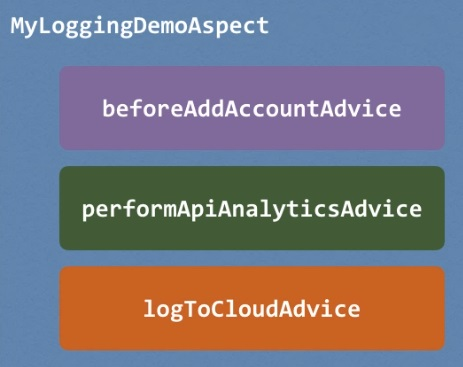

## AOP: Ordering Aspects

**Problem**

* How to control the order of advices being applied?



So, according to the specification, this order is actually undefined,
so basically, Spring will just pick on of 'em and run it and then pick the next and the next.
There's no defined order on how it'll work out. Therefore, in your application,
if you actually want to control the order on how these advices are applied
or these aspects are executed, then you have to do some additional work.
Controlling the order here, the recommendation is that you refactor your code,
you place the advices into separate aspects. This'll give us some fine grain control
and then using this approach, we can actually control the order on the aspects
using the @Order annotation. So this'll actually guarantee the order
of when aspects are applied. And I'll actually walk you through the process for doing this.

**To Control Order**

* Refactor: Place advices in separate Aspects
* Control order on Aspects using the @Order annotation
* Guarantees order of when Aspects are applied

**Refactor**

By breaking it up into smaller components, then we have more fine grain control
over actually setting up the order for those aspects.


**Add @Order annotation**


```
@Order(1)
public class MyCloudLogAspect {
    ...
}
```
