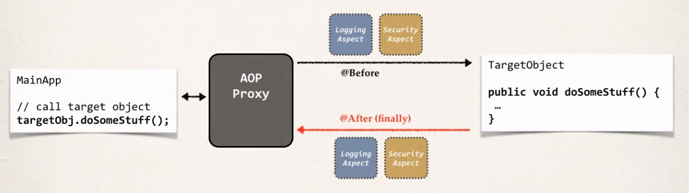
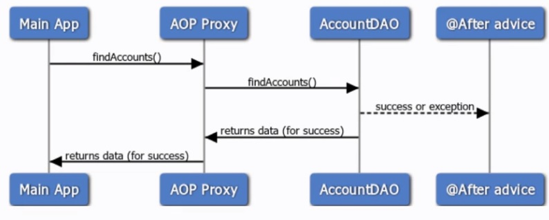
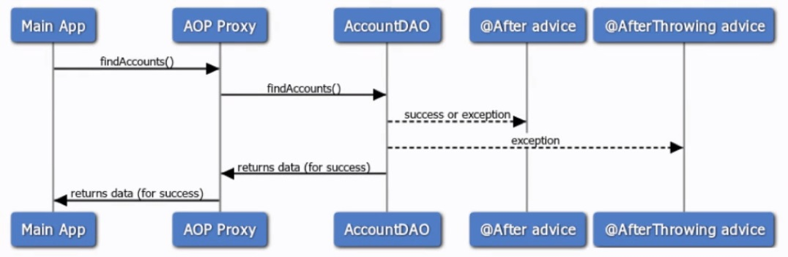

## AOP: @After Overview

> It runs after the method is completed and we call it the After Finally.

**Big Picture**

On the left-hand side, we have our main application. We make a method call on our target object
and that's over on the right-hand side. We can have our After Advice execute.

So, we have our at @Before coming in on our method call and then we have the @After.
The important thing is that this runs after the method is completed
regardless of the outcome for success or failure, this code will always run.
And this works just like the finally block with normal try catch finally code in Java.

**Sequence Diagram**

What we do is we start with our main application and then we make a call on the AccountDAO for find accounts.
So, with AOP, it goes through our AOP Proxy and then eventually makes it over to our AccountDAO.
Now at this point, if we have success or failure, like an exception, the After Advice will always run.
It runs for both cases, success or failure. Once that code completes, then it'll go back and return it back to the AccountDAO,
return it back to the proxy and finally return back to the main application so it could return data or could be returning the exception.
The key here is at the After Advice will always run regardless of the outcome success or failure.

**@After will execute before @AfterThrowing**

The After Advice relates to the After Throwing. So, if you have both of these matching
on the exact same point cut, the After Advice will execute before the After Throwing.

So, we start here with our main application. We make a call to find accounts,
hits our AOP Proxy and then eventually moves over to the AccountDAO.
Now for a success or on exception, the After Advice will always execute.
Then once that's done, then it will run the After Throwing and then eventually return back to the main app.
The key here is that the after will run before the After Throwing.

**@After Advice - Use Cases**

* Log the exception and / or perform auditing
* Code to run regardless of method outcome
* Encapsulate this functionality in AOP aspect for easy reuse