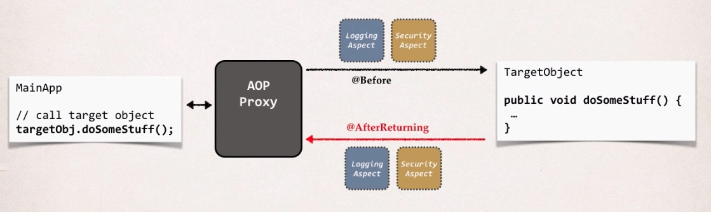
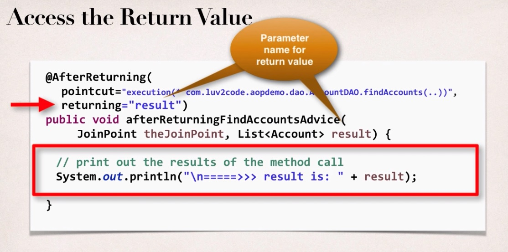

## AOP: @AfterReturning Overview

This runs after the method has been completed for successful execution.
On the left hand side we have our main application, they're going to call some method on
our target object all the way on the right hand side. And remember, with AOP, we have method calls going in.
You can pre-process using the @Before. 

The target object its code will execute and then the return coming back,
we can actually make use of this new advice type,After Returning, to write code that'll execute after
that method has been completed or after it's returning a value or data.
Now let's kind of dig in a little bit deeper here on this interaction.
So, we have our calls coming into this target object. @Before and again,
we've covered that in great detail, already. Now with this new Advice Type, After Returning,
that'll give us a chance to write our own custom code, once we have successful execution
for a given method call with no exceptions.

**@AfterReturning Advice - Use Cases**

* Most common
    * logging, security, transactions
* Audit logging
    * who, what, when, where
* Post-processing Data
    * Post process the data before returning to caller
    * Format the data or enrich the data (really cool but be careful)
    
**Access the Return Value**

We can simply print out the results of the method call. Because at this point,
AOP is injected or placed the Return Value into this Result Parameter and then
we can actually use it now and here I'll just keep it real simple,
just to assist my print line and I'd print out the result
and that's the variable or the parameter that's being passed in.
So that's basically it, that's how you access the results.