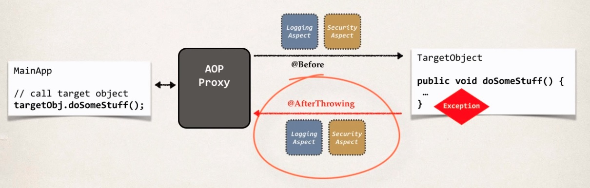
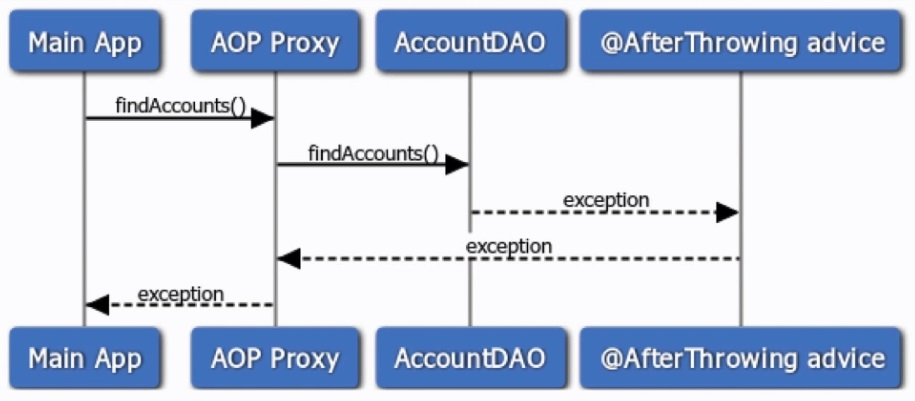

## AOP: @AfterThrowing

> This advice runs after the method if an exception is thrown.

**Big Picture**

Starting on the left-hand side, we have our main application, it's going to call
a method on our TargetObject. And that's our TargetObject here on the right.
Do some stuff. So, just like before you have your @Befores coming in.
They can process this for us those advice types. Then, we have our TargetObject that will do some stuff.
In this case we have an exception, and that will actually trigger the @AfterThrowing Advice,
and we can post process that advice once it's been thrown.

**Sequence Diagram**

Starting on the far left. We have our main application makes a call findAccounts
goes into our AOP proxy which delegates that call to the AccountDAO findAccounts,
and then we say hey there's an exception.

Then, it will actually call the @AfterThrowing Advice so we can kind of post process,
or just you know read that advice. And then that exception still propagated back to
the AOP proxy and then from the AOP proxy the exception is propagated back to the main application.

Once the exception is thrown we have a chance to read that exception. The exception is still propagated back to the main application.

**@AfterThrowing Advice - Use Cases**

* Log the exception
* Perform auditing on the exception
* Notify DevOps team via email or SMS
* Encapsulate this functionality in AOP aspect for easy reuse
