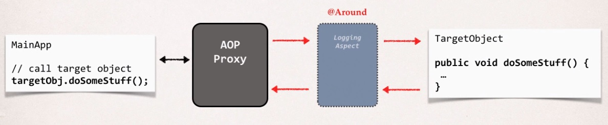
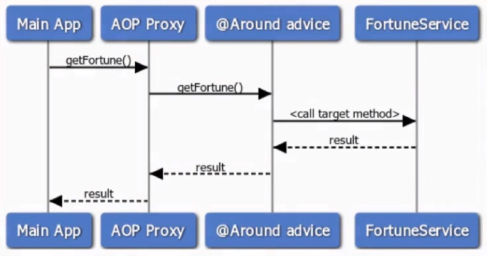
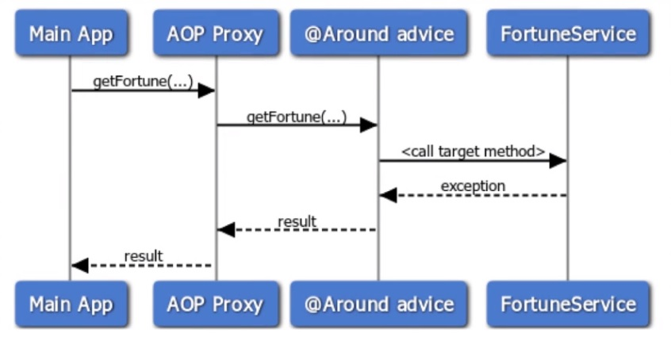

## AOP: @Around Advice Overview

> This advice runs before and after the method execution.

**@Around Advice - Interaction**

Over on the left hand side we have our main application, make a call on a target object
that goes through the AOP proxy, goes through the Around advice,
and then we make it to our target objects. So it makes a call before
and after the target object.

Basically, we have our target object and with our around advice we can actually execute code
before we make the method call and then we can also get the results after
that method call is complete. And the Around advice is really like a combination of the before and after.
But it gives you more fine-grained control over the process.

**@Around Advice - Use Cases**

* Most common: logging, auditing, security
* Pre-processing and post-processing data
* Instrumentation / profiling code
    * How long does it take for a section of code to run?
* Managing exceptions 
    * Swallow / handle / stop exceptions
    
**Sequence Diagram**

We'll start with our main application. Our main application will call the FortuneService,
it'll call getfortune. It'll go through our AOP proxy, which in turn will go through our Around advice,
and then our Around advice will actually call the target method on the FortuneService.
The FortuneService will execute, it'll give us back a result in the Around advice.
That advice can log it, post-process it, and then we'll send it back to the AOP proxy,
back to the main application.

**ProceedingJoinPoint**

* When using @Around advice
* You will get a reference to a **"proceeding join point"**
* This is a handle to the **target method**
* Your code can use the **proceeding join point** to execute **target method**

**Resolving Print Order Issue**

* Root Cause
    * The data is printing to two different output streams
    * Spring is printing to the logger output stream
    * System.out.println is printing to the standard out output stream

* Solution
    * To have everything in order, you should send to same output stream
    * We'll change our code to use the logger output stream ... same as Spring
    
## AOP: @Around Advice - Handling Exceptions

**ProceedingJoinPoint**

* For an exception thrown from proceeding joint point
    * You can handle / swallow / stop the exception
    * Or you can simply rethrow the exception
    
* This gives you fine-grained control over how the target method is called

So, we're going to have our Main Application, it's going to make a call to the Fortune Service,
we'll call get Fortune, it'll make it into the ALP proxy. From there, it'll make it to the Around advice.
The Around advice will actually call the target method so we have our get Fortune method that executes
and oh my gosh, there's an exception, something blew up. We make it back to the Around advice, at this point
we'll actually handle the exception so the Around advice will catch the exception and then handle it,
and then send back just a regular result stream to the calling program.

This result stream will make it back to the AOP Proxy and then make it back to our Main Application.
So the key here is that when the exception's thrown, we actually handle it in our @Around advice.
In our Around advice we basically log the exception, and then we assign a default Fortune that we can pass
back as a result to the main program. The main program never knows an exception was thrown,
because we've handled it in our Around advice.