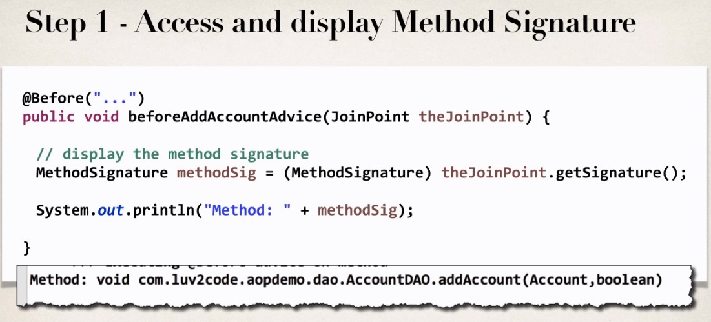
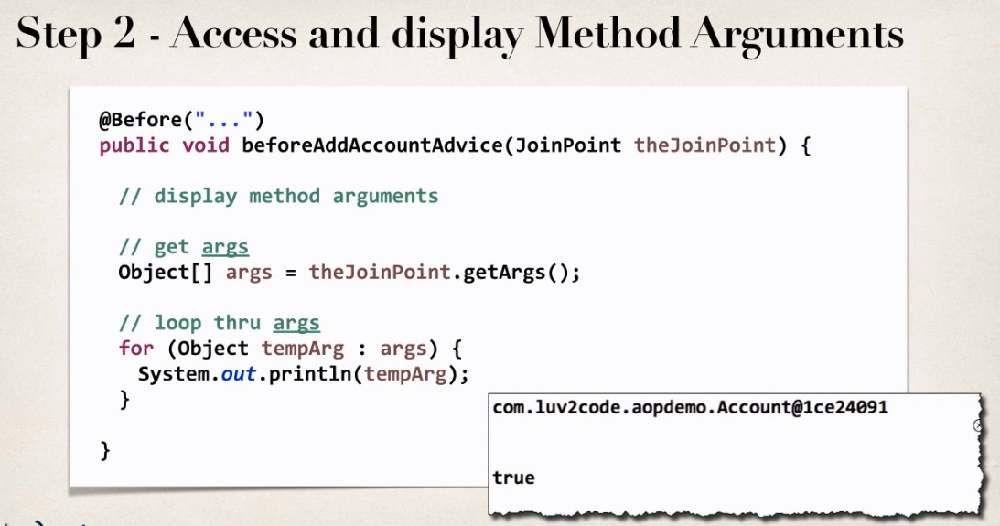

## AOP JoinPoints

**Problem**

* When we are in an aspect
    How can we access method parameters?
    
_MainDemoApp.java_
```
// call the business method 
Account myAccount = new Account();
theAccountDAO.addAccount(myAccount, true); // I want to log these params with AOP
```

**Step 1 : Access and Display Method Signature**



So for this advice that we create, we can add a new argument here, called JoinPoint.
JoinPoint would give us information about the method that we're actually executing.
I can actually use this snippet of code here to actually access the Method Signature.

`theJoinPoint.getSignature();`

downcast its way method signature object, and then I can simply print out the actual method signature.
And at the bottom here is a little display, or a snippet of what that output will look like.
So they'll give you the actual return type, they'll give you fully qualified name of the method,
and it'll also give you the parameters, or the types of arguments that are being passed
into that given method. In this case, we have an account and a Boolean object being passed in.

**Step 2 - Access and display Method Arguments**



Now, with step two is accessing and displaying the method arguments.
So here, again I can make use of that JoinPoint parameter for the advice, and then here I'll say,
theJointPoint.getArgs, it'll give you an array of arguments, in this case an array of objects.
And then we can simply loop through those arguments, and then display them.