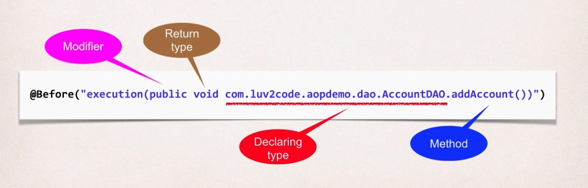
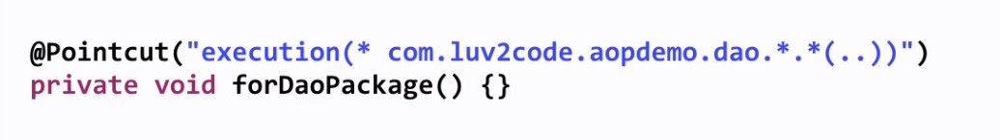
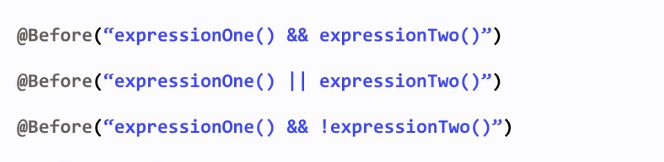

## Pointcut Expressions

**AOP Terminology**

> Pointcut: A predicate expression for where advice should be applied

So basically what you're going to do is you're going to tell the Spring AOP system,
hey if these conditions are met, then go ahead and apply the given advice code.

**Pointcut Expression Language**

* Spring AOP uses AspectJ's pointcut expression language
* We will start with execution pointcuts
    * Applies to execution of methods
    
So Spring AOP actually uses the AspectJ's pointcut expressions language.
They have a lot of different pointcuts. We'll simply start with the execution pointcut
and this basically applies to the execution of a given method.

```
execution(modifiers-pattern? return-type-pattern declaring-type-pattern? 
            method-name-pattern(param-pattern) throws-pattern?)
```

Τhis is for an execution pointcut and we need to match on some given names or patterns.
So we'll start, we'll first start of with the modifiers-pattern
then we have the return-type-pattern. Basically are you returning void,
boolean, string, lists, whatever. Next we have the declaring-type-pattern.
Basically what's the class name of the type that you're going to use for this given method.
Then we have the actual method-name-pattern, so you can give the actual name itself,
or make use of wildcards. Then we have the parameters, okay so we can match
on a method for a given parameter list. And then finally we have the throws-pattern
saying, hey let's match on a method that throws a given exception.

**_The pattern is optional if it has an question mark `?`._**

**Pattern Wildcards**

We can basically make use of the asterisk, or the star, as a wildcard
and this'll basically match on everything. And so I'll show you some examples of matching
on like using wildcards for like the modifiers, the return types and also for the actual method name.

```
execution(modifiers-pattern? return-type-pattern declaring-type-pattern? 
            method-name-pattern(param-pattern) throws-pattern?)
```

**Pointcut Expression Example**



**Parameter Pattern Wildcards**

* For param-pattern

    * ()   - matches a method with no arguments
    * (*)  - matches a method with one argument of any type
    * (..) - matches a method with 0 or more arguments of any type
    
## PointCut Declarations

The simply copy paste technique works, but it's not ideal because if we wanted to make any changes
to that pointcut expression, we'd have to go through and update it in all the locations
and that's not really what we want to do.

The ideal solution is to create the pointcut declaration once,
and apply it to multiple advices, and this actually works out with our development process.



```
@Aspect
@Component
public class MyDemoLoggingAspect {

	@Pointcut("execution(* com.luv2code.aopdemo.dao.*.*(..))")
	private void forDaoPackage() {}
	
	@Before("forDaoPackage()")
	public void beforeAddAccountAdvice() {		
		System.out.println("\n=====>>> Executing @Before advice on method");		
	}
	
	@Before("forDaoPackage()")
	public void performApiAnalytics() {
		System.out.println("\n=====>>> Performing API analytics");		
	}
	
}
```

**Benefits of PointCut Declarations**

* Easily reuse pointcut expressions
* Update pointcut in one location
* Can also share and combine pointcut expressions( coming up later )

**Combining Pointcut Expressions**

* Combine pointcut expressions using logic operators
    * AND (&&)
    * OR (||)
    * NOT (!)
    
