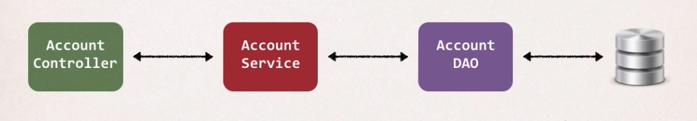
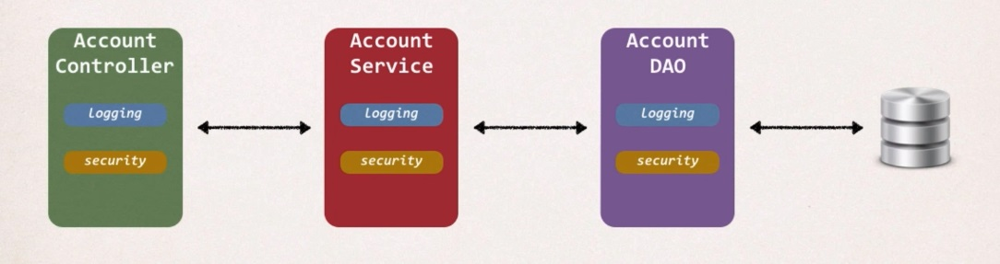
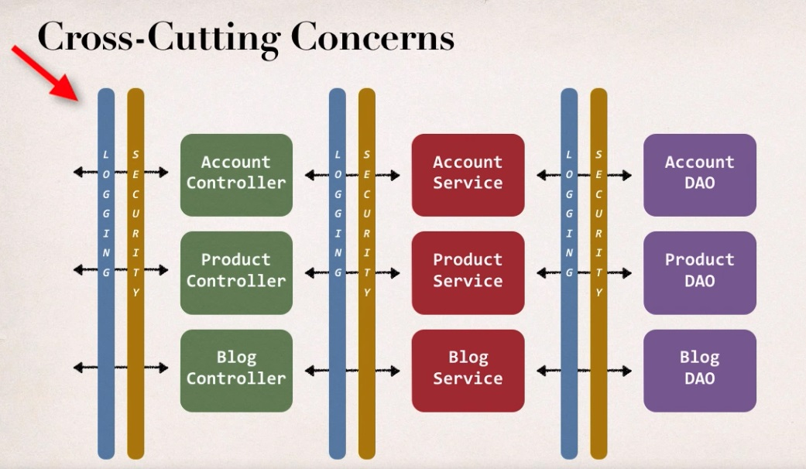
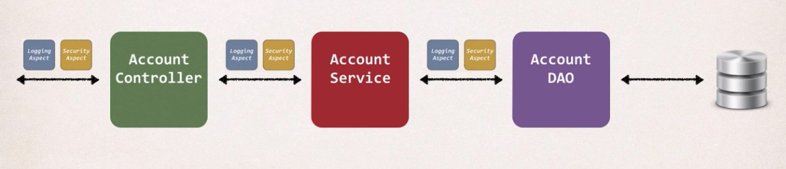
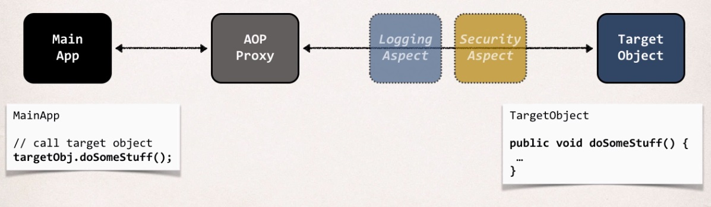

## Aspect-Oriented Programming (AOP)

**Application Architecture**



**Code for Data Access Object**

So basically we have a method here called add account they pass it on account object and a user ID
and we basically just use this to actually save it to our database.
So, we say session factory, get current session, and current session dot save.

```
public void AddAccount(Account theAccount, String userID) {

    Session currentSession = sessionFactory.getCurrentSession();
    
    currentSession.save(theAccount);
    
}
```

**New Requirement - Logging**

* Need to add logging to our DAO methods
    * Add some logging statements before the start of the method.
    
* Possibly more places ... but get started on that ASAP!

```
public void AddAccount(Account theAccount, String userID) {

    // add code for logging

    Session currentSession = sessionFactory.getCurrentSession();
    
    currentSession.save(theAccount);
    
}
```

**New Requirement(2) - Security**

* Need to add security code to our DAO
    * Make sure user is authorized before running DAO method
    

```
public void AddAccount(Account theAccount, String userID) {

    // add code for logging
    
    // add code for the security check

    Session currentSession = sessionFactory.getCurrentSession();
    
    currentSession.save(theAccount);
    
}
```

**By the way**

* Let's add it to all of our layers or entire system :/



**Two Main Problems**

* **Code Tangling**
    * For a given method: addAccount(...)
    * We have logging and security code tangled in
    
* **Code Scattering**
    * If we need to change logging or security code
    * We have to update ALL classes
    
**Solutions**

* **Inheritance?**
    * Every calss would need to ingerit from a base class
    * Can all classes extends from your base class? ... plus no multiple inheritance

Think about my days back at the university or think about some previous projects and ah inheritance.
So I'll create this base class that has the treaty and logging and then everyone will inherit from that,
well that could work depending on your system, but that will require for all classes to extend
from this base class. So you still go through and touch all your code and make an extent from that base class.

_And then what if they already extend off of another class?_

Remember, Java doesn't support multiple inheritance so you can't extend off of two classes
or multiple classes at the same time. So that solution just kind of really won't work for a large
scale or a real time or real world project.

_What about Delegation?_

* Classes would delegate logging, security calls
* Still would need to update classes if we wanted to
    * add / remove logging or security
    * add new feature like auditing, API management, instrumentation
    
We'll simply delegate those calls to like a logging manager or we'll delegate it
to a security manager. But again we'll still have to go back
and update those classes for that support. Or if there are any new features like auditing
or API management or instrumentation you would still have to go back and touch all of those classes.
And again you know we really don't solve the problem, we simply move it from one area to another.

****THE SOLUTION****

The solution is Aspect-Oriented Programming 

* Programming technique based on concept of an Aspect
* Aspect encapsulates cross-cutting logic

_Cross-cutting concerns_

So a concern really just means logic or functionality. So it's like basic infrastructure code
that all applications will need.



So here's an example of using cross cutting concerns; again cross cutting logic or functionality.
So it's like infrastructure code so in our project we're going to need to have logging security at all different
layers or different levels of application. So we can basically take that logging code encapsulated in
this reusable module or reusable class. And then we can have that code be called
when they make appropriate calls to account controller, product controller, whatever.

**Aspects**

* Aspects can be reused at multiple locations
* Same aspect / class ... applied based on configuration



So, that's the idea of an aspect that can be reused at multiple locations.
Therefore, an aspect is really just a class. Moreover, that same aspect of clients
can be applied to different parts of your project based on configuration.
So you could say hey apply the logging aspect to the account controller class, apply the security aspects
to the account controller class and so on. Finally, you create the asset at one location
and then you can apply it accordingly with configuration.

## AOP Solution

* Apply the proxy design pattern



So you have your main application on the left, it's going to call the target object on the right.
Then, your main app will say targetObj.doSomeStuff. Your target object has that method, do some stuff.
Now the main application has no idea about AOP. The main app has no idea about any aspects
or any proxies, they're simply going to make a method call.

_BUT, it's being proxied, and you have these others that are listening on that line._

So you have like a logging aspect listening on your phone conversation,
security aspect listening on your phone conversation, and then they can take action based on
anything that you say or pass across or whatever.

**Benefits of AOP**

* **Code for Aspect is defined in a single class**
    * Much better than being scattered everywhere
    * Promotes code reuse and easier to change
    
* **Business code in your application is cleaner**
    * Only applies to business functionality: addAccount
    * Reduces code complexity
    
* **Configurable**
    * Based on configuration, apply Aspects selectively to different parts of app
    * No need to make changes to main application code ... **_very important!_**
    
**Additional AOP Use Cases**

* **Most common**
    * logging, security, transactions
* **Audit logging**
    * who, what, when, where
* **Exception handling**
    * log exception and notify DevOps team via SMS / email.
* **API Management**
    * how many times has a method been called user
    * analytics: what are peak times? what is average load? who is top user?
    
**AOP: Advantages and Disadvantages**

* Advantages:
    * Reusable modules
    * Resolve code scatter
    * Applied selectively based on configuration
    
* Disadvantages:
    * Too many aspects and app flow is hard to follow
    * Minor performance cost for aspect execution (run-time warning)
    
So the key here is that use the aspects in moderation and make use of some rules and governance on your team
to have a good idea as far as the aspect development, as far as who's creating them and who's applying them.
Also there's a minor performance cost for aspect execution if you're using run-time weaving,
which Spring AOP makes use of. So it's a small performance hit, not a big deal,
it's like nanoseconds, milliseconds, but again you don't want to overdo it.
So if you have a small number of aspects you may not even notice it,
but if you start to add a lot of aspects in there that perform very expensive operations
then you'll definitely feel it.
    
## Aspect-Oriented Programming(AOP) | Spring AOP Support

**AOP Terminology**

* **Aspects**: module of code for a cross-cutting concern(logging, security, ...)
* **Advice** What action is taken and when it should be applied
* **Join Point**: When to apply code during program execution
* **Pointcut**: A predicate expression for where advice should be applied

**Advice Types**

* **Before advice**: run before the method
* **After finally advice**: run after the method (finally)
* **After returning advice**: run after the method(success execution)
* **After throwing advice**: run after the method(if exception thrown)
* **Around advice**: run before and after the method

**Weaving**

* Connecting aspects to target objects to create an advised object
* There are different types of weaving
    * Compile-time, load-time or run-time
* Regarding performance:  run-time weaving is the slowest

**AOP Frameworks**

* Two leading AOP Frameworks for Java
    * Spring AOP
    * AspectJ
    
**Spring AOP**

* Spring provides AOP support
* Key components of Spring
    * Security, transactions, caching etc
* Uses run-time weaving of aspects

Spring provides AOP support out-of-the-box, and it actually uses AOP in the background,
so Spring uses AOP for security, transactions, caching, that's all kind of built
into the Spring framework automatically.

But we'll actually write our own AOP stuff on top of that functionality.
And Spring makes use of run-time weaving of aspects so spring makes use of the Proxy pattern
to advice an object, so the main application will talk to a proxy all the aspects are processed
and then it makes it into the actual target object. So this is an example of run-time weaving,
and that's what Spring AOP supports.


**AspectJ**

* Original AOP framework, released in 2001
    * www.eclipse.org/aspectj
* Provides complete support for AOP
* Rich support for
    * join points: method-level, constructor, field
    * code weaving: compile time, post compile-time and load-time
    
Now, the other framework is AspectJ, and so it's the original AOP framework
that was released in 2001, and here's the website for it eclipse.org/aspectj.
So this provides complete support for AOP meaning the full AOP spec, or the full AOP stack
Aspect for J provides support for. So the rich support is as for as join points,
so it has join points for method-level, constructor-level and also field-level join points.
And also code weaving, they have compile-time code weaving, post compile-time and low-time weaving.
So a lot of rich support here for Aspect for J.

**Spring AOP vs AspectJ**

So the advantages of using Spring AOP is that it's simpler to use than AspectJ,
it makes use the Proxy pattern and you can easily migrate to AspectJ by making use
the @Aspect annotations. Now some disadvantages with the Spring AOP is that
it only supports method-level join points, and you can only apply aspect to beans
that have been created by the Spring app context. And also there's a minor performance cost
for aspect execution, because Spring AOP makes use of run-time weaving.

* Advantages Spring AOP:
    * Simpler to use than AspectJ
    * Uses Proxy pattern
    * Can migrate to AspectJ when using @Aspect annotation
    
* Disadvantages Spring AOP:
    * Only supports method-level join points
    * Can only apply aspects to beans created by Spring app context
    * Minor performance cost for aspect execution (run-time weaving)

AspectJ, it supports all of the join points, it works with any POJO, not just the bean
from the Spring app context, but any POJO. AspectJ also has faster performance compared to Spring AOP
and AspectJ has complete AOP support, the full stack, the full API.
But some disadvantages here with AspectJ is that the compile-time weaving requires an extra compilation step.
So it's faster but you have to do an extra compile step for the compile-time weaving.
And then also, AspectJ pointcut syntax can become very complex, very quick.

* Advantages AspectJ:
    * Support all join points
    * Works with any POJO, not just beans from app context
    * Faster performance compared to Spring AOP
    * Complete AOP support
    
* Disadvantages AspectJ:
    * Compile-time weaving requires extra compilation step
    * AspectJ pointcut syntax can become complex