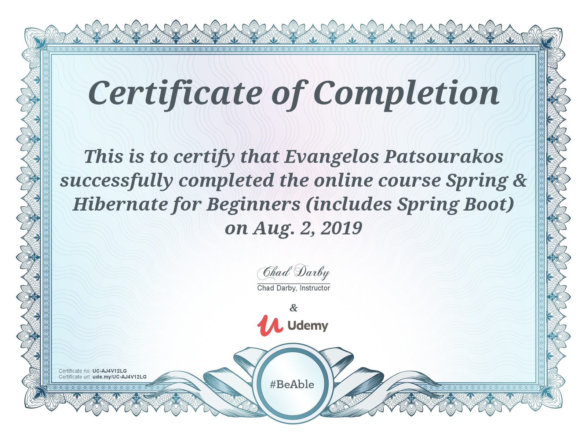

### Why Spring?

So, Spring in a nutshell. Basically, Spring is a very popular framework for building
enterprise Java applications. When Spring first came out,  it was initially a simpler,
lightweight alternative to J2EE.  They basically give you a large number of helper classes
to make enterprise development easier. Spring has huge momentum, huge market share.
So there's a lot of Apps that are already out there written using Spring and there's
a lot more that are going to be created using Spring. So that's why Spring is very
 popular now and kind of why it's still popular. It's a lightweight framework,
 it's simple, easy to use and a lot of developers like it.

### Spring Framework Overview

So, first off, here's the official website for Spring. It's at www.spring.io.
This is where you can get all the documentation for Spring, you can download Spring,
 you can look at some tutorials and also some getting started guides, and we'll use
 this website a lot during this course.
 
#### Goals of Spring
* **LightWeight development with Java POJOs (Plain-Old-Java-Objects)** make it much simpler to build,
 as compared to the heavyweight EJBs from the early versions of J2EE.
* **Dependency injection to promote loose coupling**. So instead of hard wiring your objects together,
you simply specify the wiring via a configuration file or annotations, and we'll cover that a lot in this course.
* **Declarative programming with Aspect Oriented Programming, or AOP**. This'll basically allow you to
add some applicationwide services to your given objects.
* **Minimize boilerplate Java Code**

### Core Container
So the Core Container's like the heartthrob, the main, I guess, the main item here of Spring.
So basically, it manages how Beans are created. It has a Bean factory for creating the Beans.
It basically can reconfig. files for setting properties, independencies and also the Context here's really the Spring Container
that holds the Beans in memory.

### Aspect Oriented Programming
So this is where you have support for Aspect Oriented Programming. So basically, what AOP, 
in a nutshell, it allows you to create these applicationwide services, like logging, security,
transactions, instrumentation and then you can apply these services to your objects in a declarative
 fashion, so no need to modify your code to have support for this. You simply add a config. in the
 config. file or an annotation, and that service will be applied to your application.

### Data Access Layer 
So then, moving forward here, let's take a look at the Data Access section or integration.  So basically,
here, this is for communicating with the database, either a relational database or a NoSQL database.
And also, making use of, like, a message queue.  So on the top left, you have JDBC.  Basically,
Spring provides some helper classes to make it much easier to access a database, using JDBC.
And, by using these Spring JDBC classes, you can actually reduce your source code by over 50%,
so a lot of good helper classes there. 

The next little bullet there is ORM, for Object to Relational
Mapping. This is probably the most popular section  of this module, here. Basically,
it allows you to hook into Hibernate,  or hook into JPAs. A lot of support and a lot of synergy
between Spring and Hibernate.

JMS, for Java Message Service, allows you to send messages to a message queue in an asynchronous 
fashion. That's a core part of JAVA EE. Here, they basically provide helper classes to allow you 
to make use of the Java Message Service, and again, you can reduce your code by over 50%
by making use of Spring's JMS integration. 

And then also, Spring has support for a transaction manager or supporting transactions, and you can
do this in a very lightweight fashion. So you can make use of transactions on methods, on database
calls, and pretty much anything you want. And a lot of other projects in the world or on the web,
make use of the Spring transaction manager.

### Web Layer
This is basically the home for the Spring MVC framework. So you can build web applications using the
Spring Core, and also making use of Spring Controllers and Spring View, so you have a full MVC layout 
here, and we'll cover this a good deal later on in the course. They also have other modules here
where you can actually interface with other web technologies, like maybe JSF or Struts, you can do 
that, but pretty much, if you're using Spring already, then it makes sense to just go ahead and use
Spring MVC. No need to pull in any other APIs, but you can do that if you want. They also have
support from remoting here, so you can actually make use of web remoting, where you can have external
clients make calls into the Spring container. Think of this like a way of doing remote procedure 
calls or RPC, or also doing distributed computed.

### Test Layer

Spring has support for test-driven development, so the framework includes mock objects for mocking 
out servlets, JNDI access, and so on. And you can do all of this outside of the container.
You can also make use of integration test by creating an application context and wiring up your
desired object. So testing is a first-class citizen here when making use of the Spring framework,
 so there's a lot of good support for it.