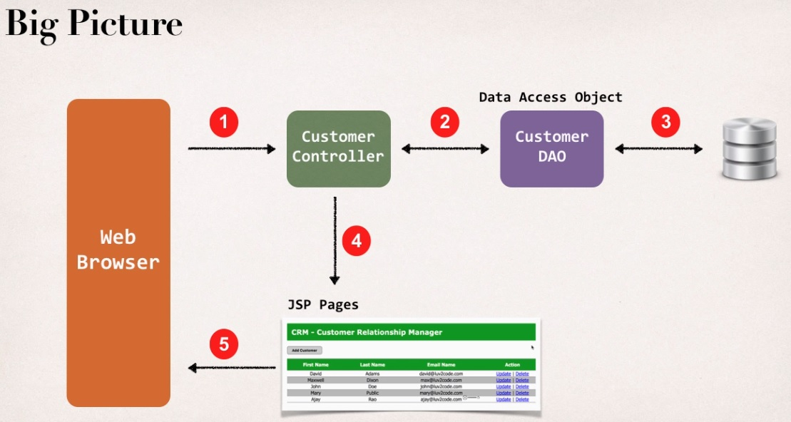

**Structure of the Project**

 
 
We're building a Customer Relationship Management application or CRM. And in 
this application, we'll be able to list customers, add a new customer, update a customer, and delete a customer. Now, before we dive in the coding, 
let's just step back for a second and take a look at the big picture. So, our browser's gonna make a request 
over to our customer controller. That customer controller is gonna make use of a data access object. 
This data access object will actually access the database for us using the Hibernate API. Then we'll get 
the data back from the database and then the controller will place that into your Spring MVC model and then 
send that over to the JSP pages. And then finally, the JSP pages will render that data to the screen. So, 
that's the big picture. So, we'll make use of a customer data access object. This is basically responsible 
for interfacing with the database. This is a very common design pattern that's used in the industry. So, if 
you join a project team, you may hear other developers or some of the senior developers refer to DAOs so 
DAO is just an acronym for Data Access Object. Again, it's really just a helper class or a utility class for 
talking to the database. In this course, our data access object will actually make use of the Hibernate API 
for accessing the data and then sending it back to whoever called the method. In our case, it'll be our 
Spring MVC customer controller. All right, now this customer data access object, it's gonna have a 
collection of methods for retrieving and updating the data. So, we'll have a method here called saveCustomer 
for adding a new customer. We'll have two methods, one for getCustomer, that'll give you a single customer, 
and the other one getCustomers, that'll give you a list of customers. You'll also be able to update a 
customer and also delete a customer. And again, we'll write all the code for these methods throughout this 
video series. We'll start off with the getter methods for actually just getting a list of customers and 
we'll move into some of the other features here. But basically, this will cover all of the major features 
here that you'll need for a CRUD application. So, CRUD meaning create, read, update, and delete. We'll 
cover all of those 'cause those are very common features that you'll need for any type of application that 
you build for the enterprise. All right, so I think we're in good shape here. Just again showing you the 
big picture. The browser's gonna send it in to our customer controller. We're gonna make use of a data 
access object and then sending the results over to a JSP page.