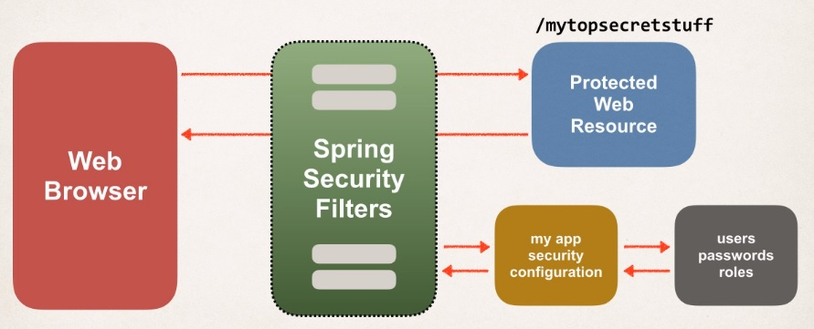
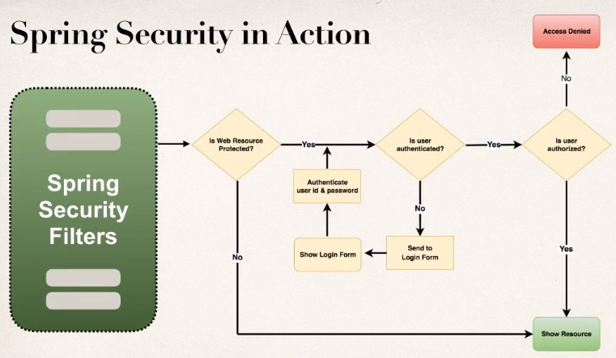
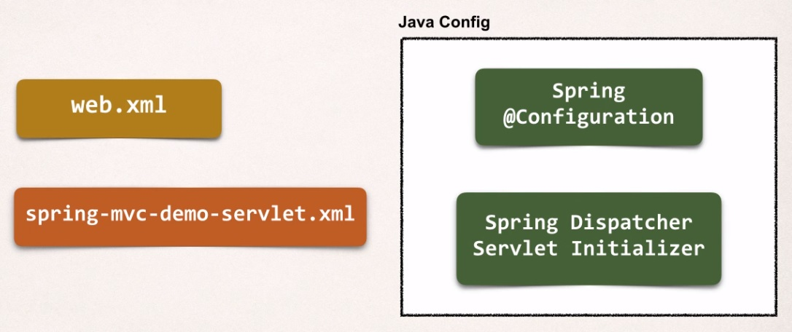

## Spring Security

**Spring Security Model**

* Spring Security defines a framework for security.
* Implemented using Servlet filters in the background.
* Two methods of securing a Web app: declarative and programmatic.

**Spring Security with Servlet Filters**

So, basically Servlet filters are used to pre-process and
post-process web request. These filters can route the web request
based on a security logic, and Spring provides a bulk of
its security functionality with Servlet filters.

**Overview**



On the left hand side, we have web browser, and then on the right you have this protected web resource,
my top secret stuff. So, the browser's attempting to access your top secret info, and get the results.

Now, this is where Spring Security comes in to play. So these Spring Security filters will basically
intercept those requests, pre-process them, and then see if the user can actually
access that protected web resource. Moreover your application security configuration,
and then also it'll take a look at the users, passwords, and roles that are in your database to see
if this user's authenticated, and also if they're authorized to access this web resource.
And this all happens in the background thanks to Spring Security.



Spring Security in action with a flowchart. So we have these Spring Security filters, and then basically
they'll say, "Hey, is this web resource protected?" Yes, then, "Is the user authenticated?"
If they're not authenticated, then send them to the login form.

Show that login form, and then take the user ID and password and authenticate it.
So, check to see if this user ID and password is valid based on the information we have stored in our system.
Then if they pass that test, so they're authenticated, so then we check to see, is the user authorized?
Do they have authorization to access this resource? So, just like at your job, right, you have a security badge,
or at your university, you have a security badge to get into the main building, however, you may not be able to access
all of the rooms in the building.

It all depends on your access level or your authorization role. So, just because you have a good user ID and password,
that doesn't mean you have access to everything. There's still additional levels of security in place,
and Spring has support with that using security roles. So, if you don't have the given role, then it'd say
access denied, or if you do have the given role, then it'll actually show you the resource
and then you can access this secure site.

**Security Concepts**

* Authentication
    * Check user id and passwords with credentials stored in app/db
    
* Authorization
    * Check to see if user has an authorized role
    
**Declarative Security**

* Define application's security constraints in configuration
    * All Java config (@Configuration, no xml)
    * Or Spring XML config
    
* Provides separation of concerns between application code and security

**Programmatic Security**

* Spring Security provides an API for custom application coding
* Provides greater customization for specific app requirements

**Different Login Methods**

* HTTP Basic Authentication
* Default login form
    * Spring Security provides a default login form
    
* Custom login form
    * your own look-and-feel, HTML + CSS
    
**Java Configuration**

* Instead of configuring Spring MVC app using XML
    * web.xml
    * spring-mvc-demo-servlet.xml
    
* Configure the Spring MVC app with Java code

**XML config to Java config**



**Web App Initializer**

* Spring MVC provides support for web app initialization
* Makes sure your code is automatically detected
* Your code is used to initialize the servlet container

## Spring Security - Add Spring Security Maven Dependencies

**Spring Security**

Basically what we need to do is add the Maven dependencies for Spring Security. Spring Security actually has two dependencies,
spring-security-web, and spring-security-config.

```
spring-security-web
spring-security-config
```

**Spring Projects**

`Spring security` && `Srping framework(core, aop, mvc, ...)`

Now, one thing that's really important here is we have the Spring Security project and then you have a separate project
that's Spring Framework that covers the core, aop, and mvc. Now, these are two separate projects.
They operate on different release cycles, and the version numbers between the projects are generally not in sync.

Spring team is actually working to resolve this for future issues, but you really need to be aware of this
as far as version numbers and the compatible versions that you use with Spring. So a common pitfall is using incompatible projects.
So you need to find a compatible version between Spring Framework and Spring Security.

**Finding Compatible Version**

* Find desired version of Spring Security in Maven Central Repo
    * spring-security-web
    
* Look at the project POM file
    * Find supporting Spring Framework version
    
**HEADS UP: New Spring Security 5.0.2  - deprecated method**

The Spring Security team released Spring Security 5.0.2 on 20 Feb 2018.

They deprecated the method: `User.withDefaultPasswordEncoder()`

We use this for the in-memory authentication section of the course. This issue only applies to in-memory 
authentication. But don't worry, this is okay for demo purposes (in-memory). Later in the course we'll store user 
accounts in the database using encryption. As a result, this will be a non-issue (there are no deprecated methods 
for database storage).

**Spring Configuration**

| Method                                     | Description                                                        |
| ------------------------------------------ | ------------------------------------------------------------------ | 
| configure ( AuthenticationManagerBuilder ) | Configure users (in memory, database, Idap, etc)                   |
| configure( HttpSecurity )                  | Configure security of web paths in application, login, logout, etc |

So, this configure method has an HTTP Security we'll use this to configure Spring Security. The first line, of
.authorizeRequests, meaning that we're gonna restrict access based on the servlet request coming in,
then we'll say .anyRequests .authenticated means that for any request coming to the app it must be authenticated.
The user must be logged in. And for our formLogin, we'll customize the login process where for the actual login page we'll show
our custom form for this given request mapping of slash showMyLoginPage. And then the login form will submit the data
or post the data to this URL for processing So we'll have slash authenticateTheUser. This is where Spring Security will go through
and check the user ID and the password. Now these two entries here, you can actually give any values for this configuration,
simply have to stay consistent in your application. And down here at the bottom we want to allow everyone to see the login page,
there's no need to be logged in. Right, 'cause they have to see something first, right? So let anyone see the login page.
And that's basically it, so that's kinda how you configure the Spring Security to, you know, reference your custom login forms.
So we have the coding here, we overwrote the method, and we set up the configs accordingly. Now, as far as the things that we need to do,
we actually need to create a controller for this request mapping. So we need to create some code, and then we need
to handle for the get mapping for slash showMyLoginPage. And then also, one other thing here is that
there's no controller request mapping required for the processing URL. So we'll have slash authenticateTheUser.
This is where Spring Security will go through  and check the user ID and the password.
Now these two entries here, you can actually give any values for this configuration, simply have to stay consistent 
in your application. And down here at the bottom we want to allow everyone to see the login page, there's no need to be logged in.

```
@Configuration
@EnableWebSecurity
public class DemoSecurityConfig extends WebSecurityConfigurerAdapter {

	@Override
	protected void configure(AuthenticationManagerBuilder auth) throws Exception {

		// add our users for in memory authentication
		
		UserBuilder users = User.withDefaultPasswordEncoder();
		
		auth.inMemoryAuthentication()
			.withUser(users.username("john").password("test123").roles("EMPLOYEE"))
			.withUser(users.username("mary").password("test123").roles("MANAGER"))
			.withUser(users.username("susan").password("test123").roles("ADMIN"));
	}

	@Override
	protected void configure(HttpSecurity http) throws Exception {

		http.authorizeRequests()
				.anyRequest().authenticated()
			.and()
			.formLogin()
				.loginPage("/showMyLoginPage")
				.loginProcessingUrl("/authenticateTheUser")
				.permitAll();	
	}
			
}
```

## Logout

**Process**

Logout URL is gonna be handled by the Spring Security Filters, you get it for free, there's
no coding required, and again, this is some more of that Spring Security magic, which is really good stuff here.
Now a little bit more on adding this logout button, we're gonna send data to that default logout URL of /logout,
so here's our form action, and then we'll have a /logout, method equals post.

When a logout is processed by default Spring Security will actually invalidate the user's HTTP session and remove
their session cookies, it will also send the user back to your login page, and they'll append a logout parameter.
And we can check for that in the login form to display a logged out message, as needed.

## Cross Site Request Forgery (CSRF)

**Spring Security**

* Spring Security protects against Cross-Site Request Forgery (CSRF)

_What is CSRF?_ 

> A security attach where am evil website tricks you into executing an action on a web application
> that you are currently logged in.

To protect against CSRF attacks, you wanna embed additional authentication data or tokens into all of your HTML forms.
So then on subsequent web request, your web app can verify the token before processing. Now in terms of Spring Security support for CSRF,
that's part of the Spring Security Filters, so these filters can actually generate tokens to send back to the browser.

You can use this in your HTML forms. And then you can send the data over accordingly. And again, the Spring Security Filters
will verify the tokens to make sure they're valid for this given user session before actually processing the request.
And the Spring Security CSRF Protection is enabled by default, so you get it for free. They make use of the Synchronizer Token Pattern,
where each request includes a session cookie and a randomly generated token. And then for the request processing,
Spring Security will verify the token before actually processing the request. And then all of this is handled behind the scenes for you
by the Spring Security Filters.

_When should you use the CSRF protection?_

Well, the Spring Security team recommends to use the CSRF protection for any normal browser web request.
If you're building a service for non-browser clients, then you may wanna disable CSRF protection
but only after careful review and you should review this with your given security team.
Now, in order to use the Spring Security CSRF Protection for your form submissions,
you should use POST instead of GET, you should include the CSRF token in form submissions,
 and the Spring MVC Form tag will automatically add the CSRF token for you.
 
## Spring Security - Restrict Access

**Development Process**

1. Create supporting controller code and view pages
2. Update user roles
3. Restrict Access based on Roles   

**General Syntax**
```
antMatchers(<< add path to match on >>).hasRole(<< authorized role >>)
```

So we're going to update our Spring Security Java configuration file, and what we'll do is make use of this general syntax here,
so we'll have ant matchers, will add a path to match on, dot has role for a given authorized role.
So for example, we can restrict access to a given path slash systems slash star star, and we'll say we want the user to have a given role.
So we say has role and then we actually give the role as a string.

 _Now what about the case where we have multiple roles here?_
 
 ```
 antMatchers(<< add path to match on >>).hasAnyRole(<< authorized role >>)
 ```
 
So we want to match on any role in the list, and we simply give a comma-delimted list of roles.
Here I could have admin comma developer, comma vip, so it'll authorize access for any role in that given list.

## Access Denied Page

Τhis will be used if there's an authorization error, or the user can not access a given page.
Spring Security will use this request mapping path to show the user the access denied page.

```
@Override
protected void configure(HttpSecurity http) throws Exception {
    ...
    .exceptionHandling()
        .accessDeniedPage("/access-denied");
}
```

## Spring Security JDBC - Overview - Defining Database Schema

So we have three users here:

| User ID | Password | Roles             |
| ------- | -------  | ----------------- |
| john    | test123  | EMPLOYEE          |
| mary    | test123  | EMPLOYEE, MANAGER |
| susan   | test123  | EMPLOYEE, ADMIN   |

Out of the box, Spring Security can read user account information from the database. So by default, you have to follow Spring Security's
predefined table schemas, but the nice thing about following their schemas is that Spring Security includes all of the JDBC code
to actually read information from the database. So there's very little Java code you have to write as far as JDBC code for reading information
from the database, all you have to do is simply setup the configuration, create the appropriate tables, and Spring Security will do all of the heavy lifting for you
in the background.

You can also customize the table schemas. This is very useful if you have custom tables specific to your given project.
The only thing is that you'll be responsible for developing the code to access the data. So you'll have to write the low level JDBC code
or hibernate code, to read from the appropriate tables, read the account information, and also read the user roles.

Spring Security has a default database schema, so you need to provide two tables, one called users, and one called authorities.
And you have to use these exact table names, and also these tables need to have these columns:
* username, password and enabled for users,
* authorities is the username and authority

**Spring Security Password Storage**

* In Spring Security 5, passwords are stored using a specific format

`{id}encodedPassword`

| ID     | Description               |
| ------ | ------------------------- |
| noop   | Plain text passwords      |
| bcrypt | BCrypt password Hashing   |

```
INSERT INTO `users` 
VALUES
('john', '{noop}test123', 1),
('mary', '{noop}test123', 1),
('susan', '{noop}test123', 1);
```

## Password Storage - Best Practice

* The best practice is store passwords in an encrypted format '{bcrypt}$af$F@#F@FDdaddf!#fa...'
* bcrypt
    * Performs one-way encrypted hashing
    * Adds a random salt to the password for additional protection
    * Includes support to defeat brute force attacks
    
**Bcrypt Additional Information**

* Why you should use bcrypt to hash passwords
 `https://medium.com/@danboterhoven/why-you-should-use-bcrypt-to-hash-passwords-af330100b861`
* Detailed bcrypt algorithm analysis `https://en.wikipedia.org/wiki/Bcrypt`
* Password hashing - Best Practices `https://crackstation.net/hashing-security.htm`

**How to Get a Bcrypt password**

You have a plaintext password and you want to encrypt using bcrypt
    
* Option 1: Use a website utility to perform the encryption
* Option 2: Write Java code to perform the encryption

 **How to Get a Bcrypt password - Website**
 
 * Visit: `https://www.browserling.com/tools/bcrypt`
 * Enter your plaintext password
 * The website will generate a bcrypt password for you
 
 
**Spring Security Login Process**

1. Retrieve password from db for the user
2. Read the encoding algorithm id (bcrypt etc)
3. For case of bcrypt, encrypt plaintext password from login form (using salt form db password)
4. Compare encrypted password from login form with encrypted password from db
5. If there is a match, login successful
6. If not match login NOT successful

## Spring Security - User Registration Form with Custom Database Tables

_Question:_

I want to add registration module into spring security login demo application. How should I do this? I want to 
access registration page from Login page through hyperlink and after submit data into database.

_Answer_

I have a document that covers this. It performs user registration with custom user details with Spring Security 
using Hibernate. Custom user details include: user name, password, first name, last name and email. You can feel 
free to extend it with additional custom fields. Demo includes Hibernate, database support, encrypted passwords. 
The code uses Maven, all Java config (no xml) Hibernate configuration

_PDF_

http://www.luv2code.com/bonus-spring-security-user-registration-custom-user

_Source Code_

http://www.luv2code.com/spring-security-user-registration-custom-user-code

**Spring Security - Select User Roles using Drop-Down List**

_Question_

In the Spring Security Registration example, what if I don't want to set Role default as Employee? Instead I want 
to take roles from user through registration page using dropdown list.  Then I want to store role data in role table and user data in user table. How can I achieve this?

_Answer_

I have a solution that covers this scenario. This includes PDF description and source code.

_PDF_

http://www.luv2code.com/spring-security-multi-role-pdf

_Source Code_

http://www.luv2code.com/spring-security-multi-role