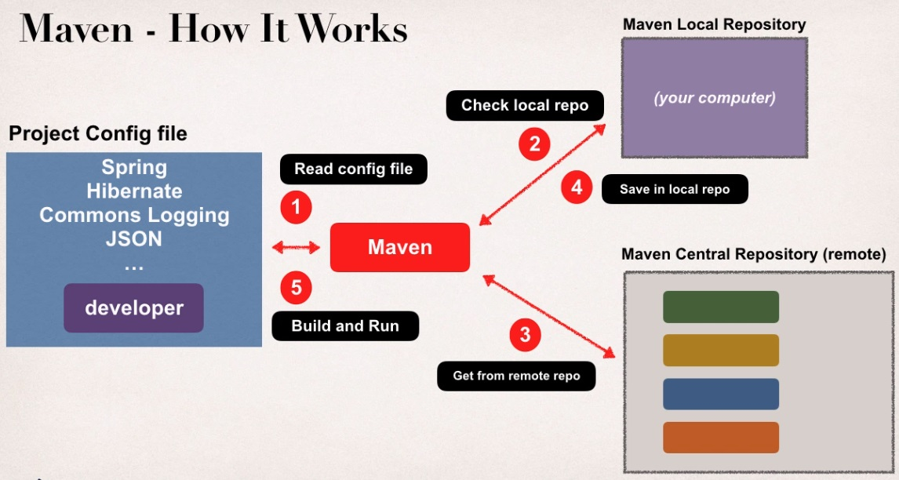
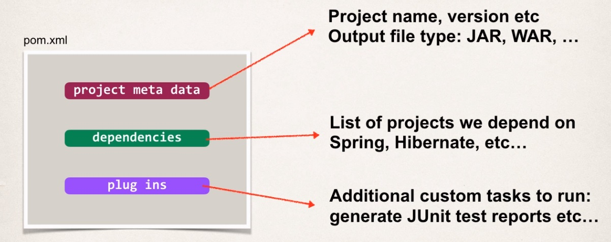
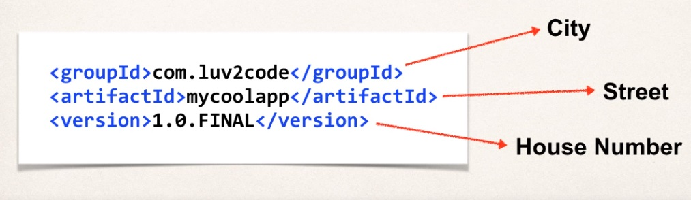

## Maven Overview

**Free Maven Resources**

* Maven Reference Manual
    * http://maven.apache.org/guides/
    
* Maven eBooks
    * www.luv2code.com/mavenbooks
    * https://www.sonatype.com/ebooks
    
* Maven Cheat Sheet
    * www.luv2code.com/mavencheatsheet
    * https://jrebel.com/rebellabs/maven-cheat-sheet/
    
**What is Maven?**

> Maven is a project management tool for your application. The most popular use of Maven is for
> build management and dependencies.

**What problems does Maven actually solve?**

When you're building your Java project, you may need additional JAR files, like Spring JAR files,
Hibernate JAR files, so on and so forth. And one approach is to simply download those JAR files
from each project website. And then you'll manually add those JAR files
to your build path or your class path.

Maven solution is that you simply tell Maven the projects you're working with, Spring, Hibernate,
and so on, and Maven will actually go out and download those JAR files for you from the Internet.
And then Maven will make those JAR files available during compile and run time.

**Maven - How It Works**

Using Maven, you have a project configuration file that Maven will read, so that's basically
your shopping list, so Maven will read your config file, then Maven will check a Maven local repository
that resides on your computer. It's like your local cache. If you don't have the files in your local repo,
then Maven will actually go out to the Internet at the Maven central repository, which is remote,
and it'll pull those JAR files down from the Maven central repo on the Internet.
Then it'll save versions of those files in your local repository, so you can kind of build up
your local cache, and then Maven will use that to build and run your application.

**Handling JAR Dependencies**

* When Maven retrieves a project dependency
    * It will also download supporting dependencies
    * For example: Spring depends on commons-logging ...
    
* Maven will handle this for us automagically

## Standard Directory Structure

Νοrmally, when you join a new project, each development team, they dream up
their own directory structure. And it's not really ideal for new comers,
and it's not standardized. So, Maven solves this problem by providing
a standard directory structure that you can use on your project.

|  Directory         |  Description                                                                       | 
| ------------------ | ---------------------------------------------------------------------------------- |
| src/main/java      | Your Java source code                                                              | 
| src/main/resources | Properties/config files used bu your app                                           | 
| src/main/webapp    | JSP files and web config files   other web assets ( images, css, etc )          | 
| src/test           | Unit testing code and properties                                                   | 
| target             | Destination directory for compiled code.   Automatically created by Maven       | 

**Advantages of Maven**

* Dependency Management
    * Maven will find JAR files for you
    * No more missing JARs
    
* Building and Running your Project
    * No more build path / classpath issues
    
* Standard directory structure

## Maven Key Concepts

**POM file**

The POM file is your Project Object Mode file. This is your configuration file for your projects
so this is basically your shopping list from Maven. This is where you tell Maven,
    
_"Hey, we depend on X number of dependencies, "go out and find those for us."_

And this POM file is always located in the root of your Maven project.

**Project Coordinates**

Project Coordinates uniquely identify a project. It's similar to GPS coordinates for your
house like the latitude and the longitude. It's precise information on how to find your
home. So, if I want just to come to visit you, I'd ask for your city, your street, and 
your house number. And that'll give me the specifics on how to find your given location. 
So the Group Id could be like the city, the Artifact ID could be the street, and then the 
Version could be the actual house number. So, some specific coordinates on how to find your 
house. And we use a similar thing here in the Maven world to identify a project.

| Name        | Description                                               |
| ----------- | --------------------------------------------------------- |
| Group ID    | Name of company, group, or organization.                  |
| Artifact ID | Name for this project: mycoolapp                          |
| Version     | A specific release version like: 1.0, ..                  |
| Version     | if project is under active development then: 1.0-SNAPSHOT |

**Dependency Coordinates**

* To add given dependency project, we need
    * Group ID, Artifact ID
    * Version is optional ...
        * Best practice is to include the version for repeatable builds
    
* GAV => 
    * **G**roup ID
    * **A**rtifact ID
    * **V**ersion
    
**How to find dependency Coordinates**

* Option 1: Visit the project page(spring.io, hibernate.org etc)
* Option 2: Visit search.maven.org

## Maven Archetypes

`archetype := starter project`

We basically use Maven archetypes to create new Maven projects and they contain
template files for a given Maven project.

So, we can really think of it as a collection of "starter files" for a project
like a Java project, Web project, etc.

| Archetype Artifact ID      | Description                                            |
| -------------------------- | ------------------------------------------------------ |
| maven-archetype-quickstart | An archetype to generate a sample Maven Project        |
| maven-archetype-webapp     | An archetype to generate a sample Maven Webapp Project |

`http://maven.apache.org/archetypes`

## Maven Repositories

There are two main repository types. There's a Local Repository and the Central Repository.
So the local repository, so as I mentioned, it's located on the developer's computer.
So, if you're using Microsoft Windows, it's in the `C:\Users\<users-home-dir>\.m2\repository`. If you're using Mac or Linux, then it's in the user's home directory slash dot m2 slash repository `~/.m2/repository`.
And so Maven will actually search this local repository first, before going out to the Maven central repository
on the web. You can think of your local repositories like your local cache.

By default, Maven will search Maven's Central Repository that's remote on the internet, and here's the actual
location of the remote repository. Now, one thing, since this is remote, it's on the internet,
it requires an internet connection. So this is a good and bad thing. So it's good if you have a network connection you can
easily grab files and pull 'em down automatically, but it's bad if you have a limited internet connection,
slow internet connection or if you have no connection at all. You'll be very limited in what you can do, depending on
the size of your local repository. So, that's kind of the good and bad thing about this
central repository. But in general, most of us have network access.

**Private Repositories**

_So what's the use case for a private repository?_

Say for example at your company you've created some super-top-secret code modules
and you'd like to share this with other development teams at your company, but you'd like to keep it private.
So these super-top-secret modules you don't wanna share with the public.

We can set up our own private Maven Repository at our company and we can actually secure this
with credentials like a user id and password and publish them to our personal server.

**Maven Repository Manager Products**

| Product     | Company  | Website            |
| ----------- | -------- | ------------------ |
| Archiva     | Apache   | archiva.apache.org |
| Artifactory | JFrog    | www.jfrog.com      |
| Nexus       | Sonatype | www.sonatype.com   |

**Cloud Hosted Solutions**

If you dont need to self-host internally at your company there are cloud hosted solutions.