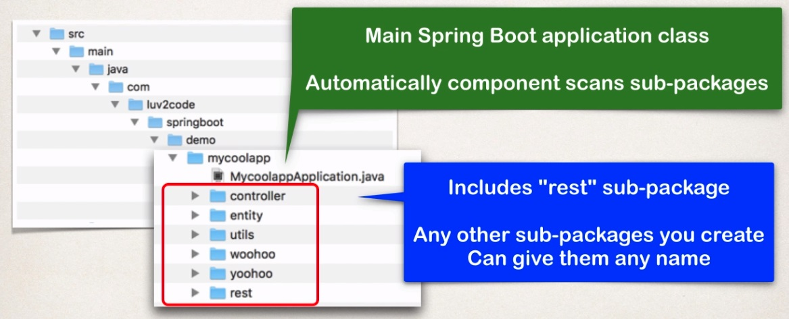
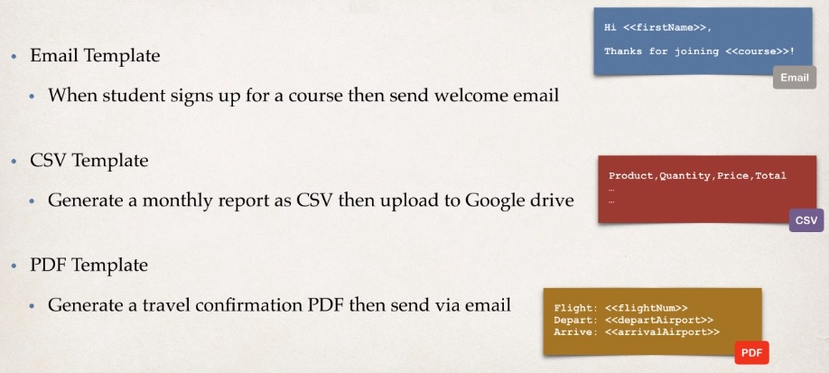

## Spring Boot Overview

**What is Spring Boot**

Spring Boot will actually perform the autoconfiguration of your application based on properties files and also the JAR
classpath, and with Spring Boot, you can help resolve dependency conflicts between like your Maven or Gradle projects,
and finally, Spring Boot provides an embedded HTTP server that you can use to get started quickly, so out of the box,
you can make use of Tomcat, Jetty, and Undertow, and that can be included or embedded in your given application,
so no need to install a separate server.

**Spring Initializr**

This is the website for quickly creating a starter Spring project. So basically you go to this website at start.spring.io,
you simply select your dependencies, and then it'll actually create a Maven or Gradle project for you that you can download
and import it into your IDE.

**Spring Boot Embedded Server**

* Spring Boot provides an embedded HTTP server so you can get started quickly,
    * Tomcat, Jetty, and Undertow, ...
* No need to install a server separately

**Deploying Spring Boot Apps**

Spring Boot apps can also be deployed in the traditional fashion, so you can deploy a WAR file to an external server
like Tomcat, JBoss, or WebSphere, and it can work just like you would use it in the past, all right, so here, we have this Tomcat server.
Let's say it's deployed somewhere in your corporate network. Then you could simply take your Spring Boot app
and then you can deploy that Spring Boot app as a WAR file with the .war extension, so now as a WAR file, you only have your code included.
There's no need to have the embedded server, because now you're deploying it in a traditional sense.
There's already a Tomcat server installed running elsewhere and we're simply deploying our WAR file to that server.
So that piece is fine, and then also on that Tomcat server, there may be other project teams that are deploying their
apps in a traditional way too, so you could have a travel team deploying their travel.war, the e-commerce group or the shopping group
deploying their WAR, so you can take your Spring Boot app and you can also deploy as a WAR file to a traditional server like you did in the past.

**FAQ**

_Does Spring Boot replace Spring MVC, Spring REST, etc?_

And the answer is no.

So there's no competition here.Instead, Spring Boot actually uses those technologies in the background.
So you have your Spring Core, you have your Spring AOP, Spring MVC, Spring REST. Spring Boot can use all
of those technologies in the background,so there is no competition, there is no replacement, all right?
So Spring Boot is mainly about configuration, so once you do your Spring Boot configs, then you can make use the regular Spring coding,
so just like you have normal @Component, @Controller, @Autowired, so and so forth, so behind the scenes,
you can still write your regular Spring Code, so there's no competition, there's no replacement. Again, Spring Boot is really about helping
you get started quickly with minimal configuration.

_Is does the Spring Boot code run faster than regular Spring code?_

And again, the answer is no, because behind the scenes, Spring Boot uses the same code of the Spring Framework,
and so like I said earlier, Spring Boot is all about making it easier to get started by minimizing the configuration,
but behind the scenes, you have your normal Spring Core, Spring REST, Spring MVC, and so on.

## Spring Boot - Project Structure

First of all Spring Boot make use of Maven Standard Directory Structure.

| Directory          | Description                                |
| ------------------ | ------------------------------------------ |
| src/main/java      | Your Java source code                      |
| src/main/resources | Properties / config files used by your app |
| src/main/test      | Unit testing source code                   |

**Maven Wrapper files** 

So the mvnw, or the Maven Wrapper files they allow you to run a Maven project, and the really cool thing about it
is that there's no need to have Maven installed, or have it present on your path. So what these files will do
is they'll say hey, if the correct version of Maven is not found on your computer, then it'll actually automatically
download the correct version of Maven, from the Internet and then actually run Maven, so it'll basically do some smarts there,
it'll automatically download it and then run it. So there's actually two files that are provided for you,
you have one of them that's the mvnw.cmd file, that's for Microsoft Windows, so you can use that to say mvnw and then you know,
normal Maven self like clean compile test or whatever. And then there's the mvnw.sh and this is for Linux or Mac systems,
so here you can say./mvnw clean compile test and so on. So that's the basic idea here of the mvnw files,
they're basically wrapper files that'll automatically download, and run the correct version of Maven, for you.

Now, if you already have Maven installed in your computer, then there's actually no need
for the mvnw files, so you can safely ignore those files, or delete them they're not required.
So in that case, since you already have Maven locally installed, you simply use Maven as you normally would so here you'd say
mvn clean compile test, so notice here there's no mvnw, you simply use mvn by itself.

**Maven POM file**

* pom.xml inludes info that you entered at Spring Initializr website
* Spring Boot Maven plugin => run application or make a war file etc

And you'll notice here that they are called Starters, so these are Spring Boot Starters, which is really just like collection of Maven dependencies
and these are the compatible versions for these dependencies. So for example, we have this spring-boot-starter-web,
well this really a collection of dependencies so it's a collection of spring-web, spring-webmvc, hibernate-validator, 
tomcat, json. So what this does is that it saves the developer from having to list all of the individual dependencies,
and also makes sure you have compatible versions, so kind of think of this kind of like a one stop shop
for grabbing some dependencies, for your given application

**Annotations**

* @SpringBootApplication is composed of the following annotations:

| Annotation               | Description                                                                            |
| ------------------------ | -------------------------------------------------------------------------------------- |
| @EnableAutoConfiguration | Enables Spring Boot's auto-configuration support                                       |
| @ComponentScan           | Enables component scanning of current package <br> Also recursively scans sub-packages |
| @Configuration           | Able to register extra beans with @Bean or import other configuration classes          |

**More on Component Scanning**

> Best Practice: Place your main application class in the root package above your other packages

* This implicitly defines a base search package
    * Allows you to leverage default component scanning
    * No need to explicitly reference the base package name
    


**Application Properties**

* By default, Spring Boot will load properties from: application.properties
    * Can add Spring Boot properties as
        * server.port= 8585
        * coach.name=Mickey Mouse
*   * /static directory is for the static resources as HTML files, CSS, images, etc
        
--- 

**_Warning!!!_**

**Do not use the src/main/webapp directory if your application is packaged as JAR.**

**Although this is a standard Maven directory, it works only with WAR packaging.**

**It is silently ignored by most build tools if you generate a JAR.**

---

**Templates**

* Spring Boot includes auto-configuration for following template engines
    * FreeMarker
    * Thymeleaf (most popular)
    * Mustache


**Spring Boot Starter Parent**

* Spring Boot provides a "Starter Parent"
* This is a special starter that provides Maven defaults

_Benifits of the Spring Boot Starter Parent_

* Default Maven configuration: Java version, UTF-encoding etc
* Dependency management
    * Use version on parent only
    * **spring-boot-starter-*** dependencies inherit version from parent
* Default configuration of Spring Boot plugin

## Spring Boot - Spring Boot Dev Tools and Spring Boot Actuator

**The Problem**

* When running Spring Boot applications
    * If you make changes to your source code
    * Then you have to manually restart your application
    
**Solution: Spring Boot Dev Tools**

* **spring-boot-devtools** to the rescue!
* Automatically restarts your application when code is updated
* Simply add the dependency to your POM file
* No need to write additional code


**Spring Boot Actuator**

* Exposes endpoints to monitor and manage your application
* You easily get DevOps functionality out-of-the-box
* Simply add the dependency to your POM file
* REST endpoints are _automatically_ added to your application
    * Endpoints are prefixed with: **/actuator**
    
| Name     | Description                               |
| -------- | ----------------------------------------- |
| /health  | Health information about your application |
| /info    | Information about your project            |
| ...      |                                           |

**Health Endpoints**

* **/health** checks the status of your application
* Normally used by monitoring apps to see if your app is up or down

**Info Endpoint**

* **/info** gives information about your application
* Default is empty
* Update **application.properties** with your app info

```
info.app.name=My Super Cool App
info.app.description=A crazy and fun app
info.app.version=1.0.0
```

* There are 10+ Spring Boot Actuator endpoints

| Name          | Description                                                     |
| ------------- | --------------------------------------------------------------- |
| /auditevents  | Audit events for your application                               |
| /beans        | List of all beans registered in the Spring application context  |
| /mappings     | List of all @RequestMapping paths                               |
| ...           | https://docs.spring.io/spring-boot/docs/current/reference/htmlsingle/#production-ready-endpoints |

To expose all actuator endpoints over HTTP

_File: src/main/resources/application.properties_
```
# Use wildcard "*" to expose all endpoints
# Can also expose individual endpoints with a comma-delimited list
# 
management.endpoints.web.exposure.include=*
```

**What about Security?**

* You may **NOT** want to expose all of this information
* Add Spring Security to project and endpoints are secured

```
<dependency>
    <groupId>org.springframework.boot</groupId>
    <artifactId>spring-boot-starter-security</artifactId>
</dependency>
```

**Secured Endpoints**

* Now when your access: **/actuator/beans**
* Spring Security will prompt for login

You can override default user name and generated password

_File: src/main/resources/application.properties_
```
spring.security.user.name=scott
spring.security.user.password=tiger
```

**Customizing Spring Security**

* You can customize Spring Security for Spring Boot Actuator
    * Use a database for roles, encrypted passwords etc..
* Follow the same techniques as regular Spring Security
    
    
## Running from command line
    
* Option 1: java -jar
* option 2: Maven plugin => mvnw spring-boot:run

## Spring Boot - Injecting Custom Application Properties

* By default, Spring Boot reads information from a standard properties file
    * Located at: **src/main/resources/application.properties**

* You can define ANY custom properties in this file

* Your Spring Boot app can access properties using @Value

## Spring Boot Properties

* Don't let the 1000+ properties overwhelm you
* The properties are roughly grouped into the following categories

`Core` `Web` `Security` `Data` <br>
`Actuator` `Integration` `DevTools` `Testing`

**Core properties**

```
# Log levels severity mapping
logginng.level.org.springframework=DEBUG
logging.level.org.hibernate=TRACE
logging.level.com.luv2code=INFO
```

**Web Properties**

```
# HTTP server port
server.port=7070

# Context path of the application
server.servlet.context-path=/my-silly-app

# Default HTTP session time out
server.servlet.session.timeout=15m

...
```

**Actuator Properties**

```
# Endpoints to include by name or wildcard
managment.endpoints.web.exposure.include=*

# Endpoints to exclude by name or wildcard 
management.endpoints.web.exposure.exclude=beans, mapping

# Base path for actuator endpoints
management.endpoints.web.base-path=/actuator

...
```

**Security Properties**

```
# Default user name
spring.security.user.name=admin

# Password for default user
spring.security.user.password=topsecret

...
```

**Data Properties**

```
# JDBC URL of the database
spring.datasource.url=jdbc:mysql://localhost:3306/ecommerce

# Login username of the database
spring.datasource.username=scott

# Login password of the database
spring.datasource.password=tiger
```

## What is JPA?

* Java Persistence API (JPA)
    * Standard API for Object-to-Relational-Mapping(ORM)
    
* Only a specification
    * Defines a set of interfaces
    * Requires an implementation to be usable
    
**What are Benefits of JPA**

* By having a standard API, you are not locked to vendor's implementation

* Maintain portable, flexible code by coding to JPA spec (interfaces)

* Can theoretically switch vendor implementations
    * For example, if Vendor ABC stops supporting their product
    * You could switch to Vendor XYZ without vendor lock in
    
**Comparing JPA to Native Hibernate Methods**

| Action                    | Native Hibernate Method      | JPA method                     |
|---------------------------|------------------------------|--------------------------------|
| Create/save new entity    | session.save(...)            | entityManager.persist(...)     |
| Retrieve entity by id     | session.get(...) / load(...) | entityManager.find(...)        |
| Retrieve list of entities | session.createQuery(...)     | entityManager.createQuery(...) |
| Save or update entity     | session.saveOrUpdate(...)    | entityManage.merge(...)        |
| Delete entity             | session.delete(...)          | entityManager.remove(...)      |

## Spring Boot - Spring Data JPA

**The problem**

* We saw how to create a DAO for Employee
* What if we need to create a DAO for another entity
    * Customer, Student, Product, Book ...
    
* Do we have to repeat all of the same code again?
    * The only difference is the entity type and primary key
    
**My Wish**

* I wish we could tell Spring:

> Create a DAO for me 
> Plug in my entity type and primary key
> Gibe me all the basic CRUD feature for free

**Spring Data JPA**

* Creates a DAO and hust plug in your entity type and primary key
* Spring will give you a CRUD implementation for Freeee..!
    * This will helps us to minimize our DAO code
    
**JpaRepository**

* Spring Data JPA provides the interface: JpaRepository
* Exposes methods (some by inheritance from parents)

## Spring Boot - Spring Data REST

The problem is that we need to go though the same implementations for each
entity of the REST API. 

So i wish that to say to spring:
> Create a REST API for me
> Use my existing JpaRepository (entity, primary key)
> Give me all of the basic REST API CRUD features for free


_So Spring Data REST will expose these endpoints for free:_

| HTTP method | URL                     | CRUD Action              | 
|-------------|-------------------------|--------------------------|
| POST        | /employees              | Create a new employee    |
| GET         | /employees              | Read a list of employees | 
| GET         | /employees/{employeeId} | Read a single employee   | 
| PUT         | /employees/{employeeId} | UPDATE a single employee | 
| DELETE      | /employees/{employeeId} | DELETE a single employee |

So, Spring Data REST will scan your project for JpaRepository and it will
expose a REST APIs for each entity type for your JpaRepository.

**In a Nutshell**

For Spring Data REST, you only need 3 items

1. Your entity: Employee
2. JpaRepository: EmployeeRepository extends JpaRepository
3. Maven pom dependency: spring-boot-starter-data-rest

**HATEOAS**

* Spring Data REST endpoints are HATEOAS compliant
    * HATEOAS: Hypermedia As The Engine Of Application State

* Hypermedia-driven site provides info to access REST interfaces like
meta-data for REST data

## Thymeleaf

**What is Thymeleaf?**

* Thymeleaf is a Java templating engine
* Commonly used to generate the HTML views for web apps
* However, it is a general purpose templating engine
    * Can use Thymeleaf outside of web apps
    
**What is a Thymeleaf template?**

* Can be an HTML page with some Thymeleaf expressions
* Include dynamic content from Thymeleaf expressions

**Where is the Thymeleaf template processed?**

* In a web app, Thymeleaf is processed on the server
* Results included in HTML returned to browser

---

> **_Thymeleaf can be used in web OR non-web environments_**

---

**Thymeleaf Use Cases (non-web)**

