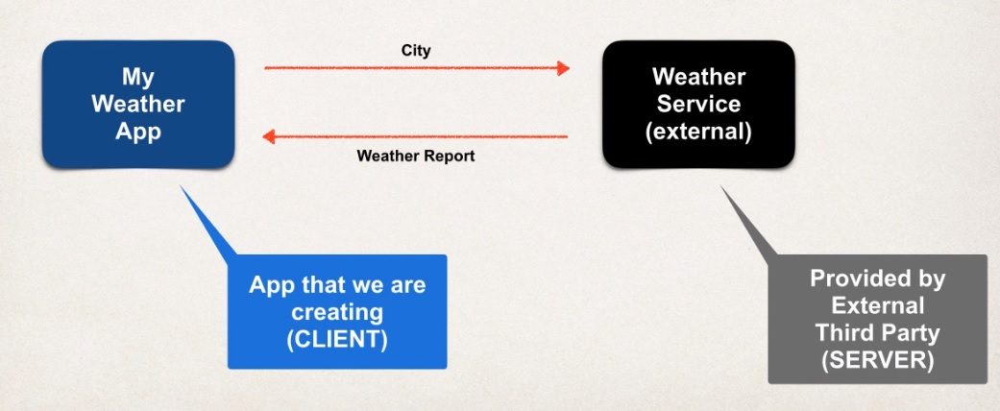
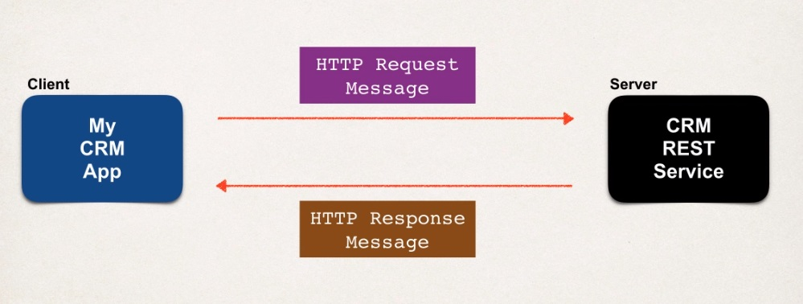
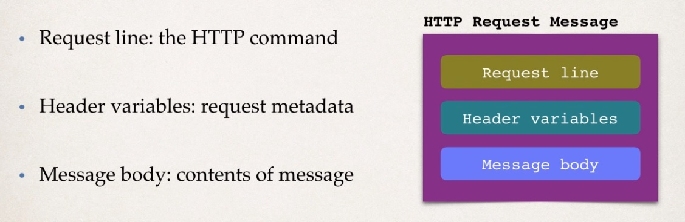
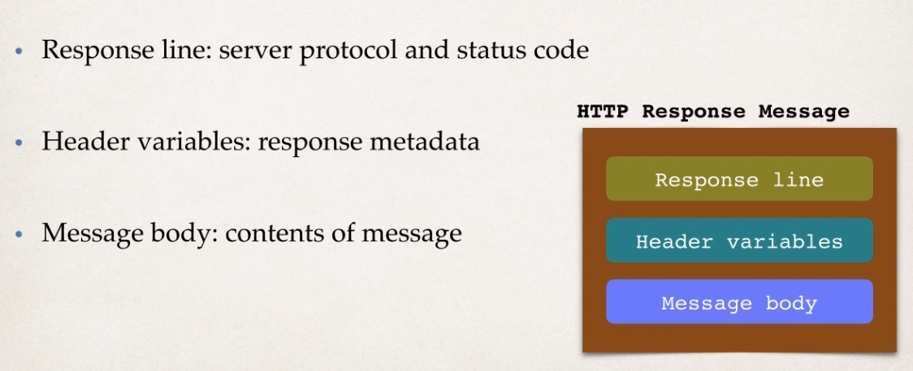
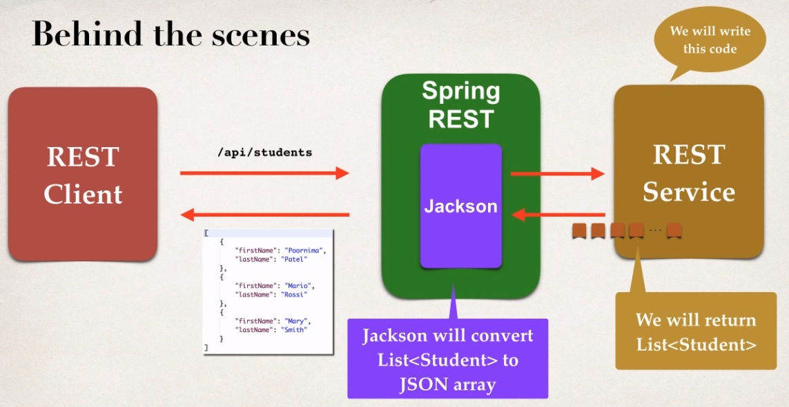

## Spring REST - What are REST Web Services?

**Application Architecture**



* How to connect to the Weather Service?
    * We can make REST API calls over HTTP
    * REST:  REpresentational State Transefer
* Lightweight approach for communicating between applications
* REST is client independent
    * The client application can use ANY programming language
    * The server application can use ANY programming language
* REST application can use any data format (common: XML, JSON)

_What do we call it?_

Do we call it REST API or RESTful API? 

Or do we call it REST Web Services or RESTful Web Services?

Or what about REST services, RESTful Services?

So generally they all mean the same thing. All right, basically you're building an API,
you're building a service, and you're providing an in point, and you're providing data based on
inputs or requests and so on.

## JSON BASICS

JSON is the **J**ava**S**cript **O**bject **N**otation. It's a Lightweight data format for storing and
exchanging data. And the really nice thing about JSON is that it's language independent,
so it's not just for JavaScript. In fact, you can use JSON with any programming language
such as Java, C#, and Python.

## Simple JSON Example

* Curley braces define objects in JSON
* Object members are name / value pairs
    * Delimited by colons
    
**JSON Values**

* Name is **always** in double-quotes
* Numbers: no quotes
* Boolean: no quotes
* String: in double quotes
* Nested JSON object
* Array: in JSON you make use of arrays with a square bracket and you simply give a comma delimited list of items here.
         So in this example is a comma delimited list of strings. 
* null

## Spring REST - JSON Data Binding with Jackson 

Data binding is the process of converting JSON data to a Java POJO or the other way. It's also known as:
* Mapping
* Serialization / Deserialization
* Marshalling / Unmarshalling

Spring uses the Jackson Project behind the scenes in order to handle the data bidding between JSON and Java
POJO. So Jackson is actually a separate project. There's a lot of synergy between Jackson and Spring,
but Jackson is a separate project for doing data binding, so they have support for doing data binding with XML,
support for data bindings in JSON and so on. It's a very popular project.
 
So, if you do any type of JSON development
in the Java world or any REST development in the Java world, there's a very good change
you're going to run across the Jackson Project. By default, Jackson will call the appropriate getter / setter method.

## Spring REST - HTTP Overview

* Most common use of REST is over HTTP
* Leverage HTTP methods for CRUD operations

| HTTP Method | CRUD Operation                           |
| ----------- | ---------------------------------------- |
| POST        | Create a new entity                      |
| GET         | Read a list of entities or single entity |
| PUT         | Update an existing entity                |
| DELETE      | Delete an existing entity                |

**HTTP Message**



We have this idea of our client application and we also have our server application.
The client's going to send over REST request to a server or a CRM REST service.
We'll send over this HTTP request message that'll have data going across
and then our server can process it and our server will send back an actual response,
an HTTP message response.

**Request and Response message Structure**





**HTTP Response - Status Codes**

For the HTTP response, you can send back a status code to give information about the status.
You have codes and different ranges. Anything in the 100 range, that's for informational.
The 200 range is for success. The 300 range is for a redirection.
The 400 range is for client error. And then we also have the 500 range for a server error.
You've seen some of this before, so for the 400 series, if you had to access a secure server,
it would send back a 401, meaning authentication required. And then also, you've all seen the 404 error,
the dreaded file not found error. The 500 internal server error.

| Code Range  | Description    |
| ----------- | -------------- |
| 100 - 199   | Informational  |
| 200 - 299   | Successful     |
| 300 - 399   | Redirection    |
| 400 - 499   | Client error   |
| 500 - 599   | Server error   |

**MME Content Types**

> It simply describes the actual content of a format of the message being returned.

* The message format is described by MIME content type
    * Multipurpose Internet Mail-Extension
    
* Basic Syntax: type/sub-type

* Examples
    * text/html, text/plain
    * application/json, application/xml, ...
    
**Client Tool**

* Send HTTP requests to the REST WEB Service / API
* Plenty of tools available: curl, Postman, etc ...


## Spring REST - Retrieve POJOs as JSON



REST Controller using those annotations for RestController and @RequestMapping for /api, so that's our basic controller there.

Now I'll go through and actually define the endpoint for /students that basically returns a list of students. We'll set up
the GetMapping for /students and then we'll define the method public List Student getStudents. Inside of this method I'll create 
a list of students and return it to the calling program. So here I'll simply just create a new array list, it's empty right now,
and then I'll just go through and add three students, Poornima, Mario, and Mary. 

At this point I'll just hard code the data for now, but we could always integrate a database later. But right now let's just kind of
keep it simple just so we get something working and then we can get us all the database stuff later. So then I'll go through and simply say
return theStudents, and remember here, Jackson will actually convert that list of students to the JSON array as it goes back to the actual REST Client.
So for our method, for this controller all we do is we simply define the method, write the code, return our POJO or our Java object,
and then all of the JSON conversions and so forth will happen automatically thanks to Spring REST and Jackson.

## Path Variables 

* Retrieve a single student by id

GET => `/api/student/{studentId}` _Retrieve a single student_

* studentId is known as a 'path variable'

Same process but this time the REST service will return a single student. To achieve that we need to bind the path variable.

## Spring REST - Exception Handling

We have this REST client, the REST service. We make a call for API students 999, that's the bad data, it makes it into 
our REST service, throws an exception, and then we'd like to actually handle for that exception and then instead of that
ugly HTML page, we'll send back the exception error message as JSON.

```
{
    "status": 404,
    "message": "Student id not found - 999",
    "timeStamp": 1526149650271
}
```


